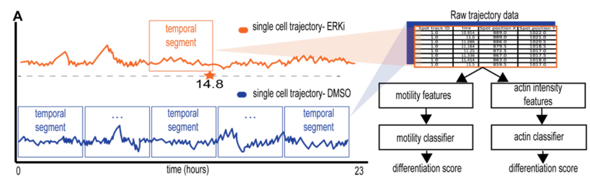

# Machine learning inference of continuous single-cell state transitions during myoblast differentiation and fusion

<!-- [](https://zenodo.org/badge/latestdoi/300036005) -->
Cells dynamically change their internal organization via continuous cell state transitions to 
mediate a plethora of physiological processes. Understanding such continuous processes is 
severely limited due to a lack of tools to measure the holistic physiological state of single cells 
undergoing a transition. We combined live-cell imaging and machine learning to quantitatively 
monitor skeletal muscle precursor cell (myoblast) differentiation during multinucleated muscle 
fiber formation. Our machine learning model predicted the continuous differentiation state of 
single primary murine myoblasts over time and revealed that inhibiting ERK1/2 leads to a 
gradual transition from an undifferentiated to a terminally differentiated state 7.5-14.5 hours 
post inhibition. Myoblast fusion occurred ~3 hours after predicted terminal differentiation. 
Moreover, we showed that our model could predict that cells have reached terminal 
differentiation under conditions where fusion was stalled, demonstrating potential applications 
in screening. This method can be adapted to other biological processes to reveal connections 
between the dynamic single-cell state and virtually any other functional readout.

## Findings summary

We used live cell imaging and machine learning to track the differentiation state of muscle cells during muscle fiber formation. Our findings include identifying the time frame of myoblast differentiation and its link to fusion events. We also validated that inhibiting fusion did not significantly affect the differentiation process. This approach has potential applications in identifying new factors and screening compounds for muscle regeneration. Our study highlights the importance of supervised machine learning in accurately inferring cell state and its broader applicability to studying other dynamic cellular processes.

See our paper (linked below) for more details and extensive resources.

## Data collection, processing and model training procedures

> **Semi-manual single-cell tracking:** Time-lapse images were converted to XML/hdf5 format, and Mastodon's FIJI plugin was used for single-cell tracking and manual correction. Cells that fused into multinucleated fibers and cells that did not fuse within the experimental timeframe were included.

> **Preprocessing trajectories:** Image registration using OpenCV's CalcOpticalFlowFarneback was performed to correct erroneous offsets in the tracked cells' trajectories.

> **Models training:** The training pipeline involved the following steps:
>   a. Determining labels for training: ERKi-treated cells were labeled as "differentiated" in a specific time segment before the first fusion event was observed, while DMSO-treated cells were labeled as "undifferentiated".
>   b. Partitioning single-cell trajectories to temporal segments: Trajectories of DMSO- and ERKi-treated cells were divided into overlapping temporal segments of equal lengths.
>   c. Extracting motility and actin features: Single-cell motility and actin intensity time series were extracted from each temporal segment.
>   d. Extracting hundreds of single-cell time series features: Features encoding properties of the temporal segments were extracted using the "tsfresh" Python package.
>   e. Training classifiers: Random forest classifiers were trained to distinguish between differentiated and undifferentiated cells.

<p align="center">

</p>

---

## Examples

### Single cell tracks registration
To reproduce our single cell registration, you can use the following example:
```python
    from data_layer.utils import *
    from data_layer.video_registrator import *
    
    reg_name = "MeanOpticalFlowReg"
    nuclei_vid_path = "data/videos/S1_nuclei.tif"
    no_reg_csv_path = "data/mastodon/no_reg_S3_all detections.csv"
    registrated_csv_save_path = "data/mastodon/MeanOpticalFlowReg_S3_all detections.csv"
    
    # load the video & single cell tracks csv for registrating the tracks according to the video.
    vid_arr = io.imread(nuclei_vid_path)
    tracks_df, _ = get_tracks(no_reg_csv_path, tagged_only=True)

    # activate registrator according to the chosen registrator's name
    registrator = video_registration_factory(reg_name)

    # compute shifts in tracks to correct them
    corrections = registrator.calc_shifts(vid_arr)

    # registrate the tracks according to the calculated shifts
    reg_data = registrator.registrate_tracks(data_to_registrate=tracks_df, flows=corrections)

    # save registrated tracks to csv
    reg_data.to_csv(registrated_csv_save_path)
```
### data preperation
You can use the module "data_preparation" for preparing & transforming single cell tracks into tsfresh timeseries vectors.
an example for preparing single cell tracks (full documentation is available with the code):
```python
from data_layer.data_preparation import *

vid_path = "data/videos/S1_nuclei.tif"
modality = "actin_intensity" # can be changed to "actin_intensity"
win_size = 16 # deafult is 16, for window size of 32X32
segment_length = 30 # length of the needed temporal overlapping segments
target = 1 # 1 for "differentiated" class, 0 for "undifferentiated".

preprocessor = data_preprocessor_factory(modality)
transformed_data = prepare_data(preprocessor, data, vid_path, win_size, segment_length, target)
pickle.dump(transformed_data, open("transformed_data.pkl", 'wb'))
```
In case you would like to parallelize the computation, you can use the method "prepare_data_in_parallel_chunks". The method will devide the data into n chunks, as n is the number of parallel runs, run the data prepartion method on each one of them, and saves the transformed data seperately. 
```python
from data_layer.data_preparation import *
# set parameters
n_tasks = 10 # how many jobs are there in total
task_id = 101 # 3 digit number to indicate the id of the current running job (out of all n_tasks) 

modality = "motility"
vid_path = "data/videos/S2_nuclei.tif"
vid_name = "S2" # represents the name of the needed file
target = 0 # 1 for "differentiated" class, 0 for "undifferentiated".
win_size = 16 # deafult is 16, for window size of 32X32
segment_length = 30 # length of the needed temporal overlapping segments
save_data_dir_path = "data/mastodon/transformed_data/"
save_data_path = save_data_dir_path + "/save_files_path"
tracks_csv_path = "data/S2.csv"

# load tracks dataset
tracks_df, _ = get_tracks(tracks_csv_path, tagged_only=True)
prepare_data_in_parallel_chunks(tracks_df=tracks_df, vid_path=vid_path, modality=modality, target=target, n_tasks=n_tasks, job_id=task_id, win_size=win_size,
                                segment_length=segment_length, save_data_dir_path=save_data_dir_path, save_data_path=save_data_path)
```
The method "concat_data_portions" from the module "merge_preprocessed_data_chunks" used to merge all tramsformed data chunks together.

```python
from data_layer.utils import *
from data_layer.merge_preprocessed_data_chunks import *

modality = "motility"
files_path = "data/mastodon/transformed_data/save_files_path"
data_save_csv_path = "data/mastodon/transformed_data/concatenated_data_chunks.pkl"

concat_data_portions(files_path, data_save_csv_path)
```


## Citation

For a complete discussion of our findings please view our preprint:

> Machine learning inference of continuous single-cell state transitions during myoblast differentiation and fusion
Amit Shakarchy, Giulia Zarfati, Adi Hazak, Reut Mealem, Karina Huk, Ori Avinoam, Assaf Zaritsky
bioRxiv 2023.02.19.529100; doi: https://doi.org/10.1101/2023.02.19.529100

